# PLC Exercises

## Exercise 2.4-2.5

See the bottom of `Intcomp1.fs` for our solution to 2.4.

## Exercise 3.2

The regex is `^(a?b)*(?(1)a?|)$`

Resulting NFA:

Resulting DFA:

# BCD Questions

## Question 2.1

- All number-strings that have the value 42:
  - `(^42$)`
- All number-strings that do not have the value 42:
  - `^(?!42(?!.)).*`
- All number-strings that have a value that is strictly greater than 42:
  - `^(?!([0-9]|[0-3][0-9]|40|41|42)(?!.)).*`

## Question 2.2

Given the regular expression `a∗(a|b)aa:`

- Construct an equivalent NFA using the method in section 2.4:
  - 
- Convert this NFA to a DFA using algorithm 2.3
  State | E-Closure | a | b | go to
  ---|--- |---|---|---
     s0 | {1, 2, 3} | {1, 4} | {5} | {s0, s1, s2}
     s1 | {4} | {6} | {} | {s3}
     s2 | {5} | {6} | {} | {s3}
     s3 | {6} | {7} | {} | {**s4**}
     **s4** | {7} | {} | {} | {}
  - 

# HelloLex questions

All files relevant to this questions can be found in the `helloLex` folder

## Question 1

The regex is `[0-9]`. The semantic value is a single whole number between 0 and 9.

## Question 2
When running `fslex --unicode hello.fsl` the file `hello.fs` is generated.
3 states.

## Question 3
As can be seen, we compiled a working `hello.exe` file.

## Question 4
We created a `hello2.fsl` file, where we updated the regex to be `['0'-'9']+`.
We then generated the lexer and compiled it as `hello2.exe`.

## Question 5
We extended it with the regex provided in the question.
We then generated the lexer and compiled it as `hello3.exe`.
