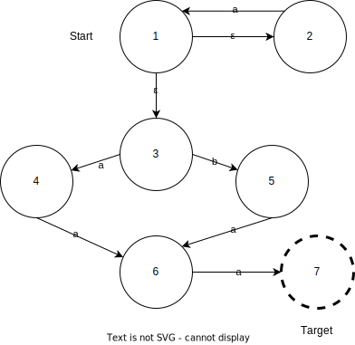
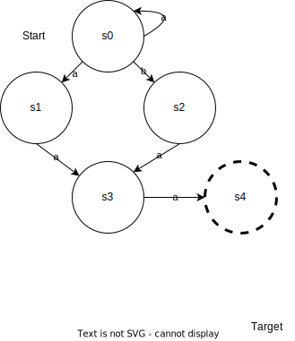

# PLC Exercises

## Exercise 2.4-2.5

See the bottom of `Intcomp1.fs` for our solution to 2.4.

## Exercise 3.2

The regex is `^(a?b)*(?(1)a?|)$`

Resulting NFA:

Resulting DFA:

# BCD Questions

## Question 2.1

- All number-strings that have the value 42:
  - `(^42$)`
- All number-strings that do not have the value 42:
  - `^(?!42(?!.)).*`
- All number-strings that have a value that is strictly greater than 42:
  - `^(?!([0-9]|[0-3][0-9]|40|41|42)(?!.)).*`

## Question 2.2

Given the regular expression `a∗(a|b)aa:`

- Construct an equivalent NFA using the method in section 2.4:
  - 
- Convert this NFA to a DFA using algorithm 2.3
  State | E-Closure | a | b | go to
  ---|--- |---|---|---
     s0 | {1, 2, 3} | {1, 4} | {5} | {s0, s1, s2}
     s1 | {4} | {6} | {} | {s3}
     s2 | {5} | {6} | {} | {s3}
     s3 | {6} | {7} | {} | {**s4**}
     s4 | {7} | {} | {} | {}
  - 

# HelloLex questions

## Question 1
When running `fslex --univode hello.fsl` the file `hello.fs` is generated. 3 states.
